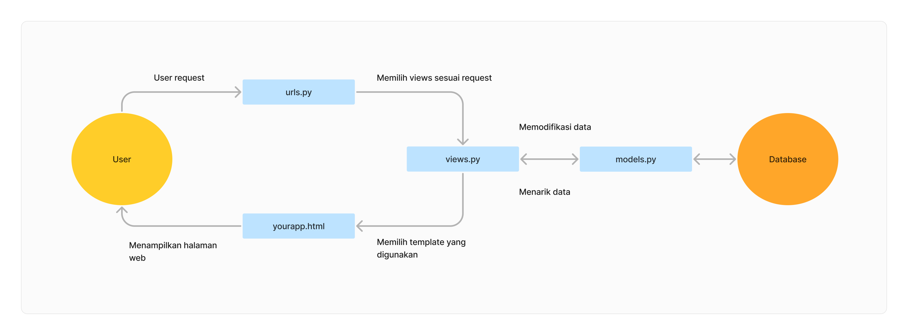

# SafareiPark
### An online inventory for a (fictional) safari park.
### Tautan aplikasi: https://safarei-park.adaptable.app/main/
---
### Pertanyaan Tugas 2
1. Langkah-langkah mengimplementasikan:
+ Membuat repositori baru di GitHub
+ Membuat repositori lokal untuk proyek ini
+ Melakukan konfigurasi Git untuk repositori lokal
+ Menghubungkan repositori lokal dengan repositori GitHub dengan ``git branch -M main`` dan ``git remote add origin https://github.com/reikathr/safarei-park``
+ Mengaktivasikan virtual environment
+ Menambahkan requirements.txt ke repositori lokal dan menginstall dependencies
+ Membuat proyek django dengan command ``django-admin startproject safarei_park.``
+ Mengatur ALLOWED_HOSTS dengan mengisinya dengan wildcard '*' agar proyek bisa diakses host/domain apapun.
+ Menjalankan server untuk memeriksa bahwa aplikasi saya berhasil dibuat
+ Keluar dari virtual environment
+ Menambahkan file .gitignore untuk menyertakan nama file yang tidak diinginkan di Git
+ Add, commit, dan push ke repositori GitHub yang sudah dibuat
+ Menambahkan aplikasi ke adaptable.io dengan New App > Connect Git Repository > Pilih reikathr/safarei-park > Choose a branch to deploy: main > Choose a Deploy Template > Pilih Python App Template > Pilih PostgreSQL > Masukkan versi Python yang sesuai: 3.9 > Isi Start Command dengan `python manage.py migrate && gunicorn safarei_park.wsgi`
+ Mengaktivasikan virtual environment
+ Membuat aplikasi main dengan `python manage.py startapp main`
+ Menambahkan 'main' ke list INSTALLED_APPS di settings.py (dalam direktori proyek)
+ Membuat direktori templates dalam main dan membuat main.html
+ Membuat berkas models.py di direktori aplikasi main yang memiliki class Items(models.Model) dengan atribut name, amount, description, dan category.
+ Mengupdate model dengan `python manage.py makemigrations` dan `python manage.py migrations`
+ Mengisi views.py di direktori aplikasi main yang akan menyambungkan antara models dan template
+ Memodifikasi template dengan atribut dalam models
+ Melakukan routing di urls.py dalam direktori aplikasi main dan direktori proyek safarei_park
+ Menjalankan dan membuka proyek
+ Membuat tests.py di main dan menambahkan test untuk memastikan path url ke /main/ dapat diakses dan sudah menggunakan template main.html
+ Menjalankan test dengan `python manage.py test`
+ Add, commit, dan push ke GitHub

2. Bagan yang berisi request client ke web aplikasi berbasis Django beserta responnya yang menjelaskan kaitan antara urls.py, views.py, models.py, dan berkas html.


3. Mengapa menggunakan virtual environment? Apakah kita tetap dapat membuat aplikasi web berbasis Django tanpa virtual environment?
Kita menggunakan virtual environment untuk memastikan dependencies untuk setiap proyek terisolasi karena proyek-proyek berbeda dapat menggunakan dependecies yang berbeda sehingga kita harus mencegah dependencies tersebut bertabrakan. Kita dapat membuat aplikasi web berbasis Django tanpa virtual environment, tetapi tidak dianjurkan untuk alasan tersebut.

4. Apa MVC, MVT, MVVM?
+ MVC (Model-View-Controller): Model menyimpan data yang diperlukan sebuah aplikasi, View menyimpan komponen yang akan ditampilkan pada layar (UI), dan Controller menerima dan memproses input dari user lalu membuat perubahan pada Model dan View berdasarkan input tersebut. MVC digunakan dalam berbagai framework.
+ MVT (Model-View-Template): Model menyimpan data, View dapat mengambil data dalam model dan merender suatu template dengan data tersebut, Template menyimpan komponen yang akan ditampilkan (UI). MVT adalah pattern yang spesifik untuk Django. Template dalam MVT berperan seperti VIew dalam MVC dan MVVM.
+ MVVM (Model-View-ViewModel): Model menyimpan data, View menyimpan komponen yang ditampilkan (UI), ViewModel menyambungkan View dan Model. Perubahan pada ViewModel akan automatis berubah di View (dan sebaliknya) dengan data binding. MVVM digunakan dalam berbagai framework.

<hr>

### Pertanyaan Tugas 3
1. Apa perbedaan antara form `POST` dan form `GET` dalam Django? <br>
`POST` dan `GET` adalah dua method HTTP yang paling sering ditemukan. Beberapa perbedaan antara `POST` dan `GET` adalah sebagai berikut (dari [W3Schools](https://www.w3schools.com/tags/ref_httpmethods.asp)): <br>

| POST | GET |
|---|---|
|Tidak bisa di-*cache*|Bisa di-*cache*|
|Tidak tersimpan di riwayat *browser*|Tersimpan di riwayat *browser*|
|Tidak bisa di-*bookmark*|Bisa di-*bookmark*|
|Tidak ada batasan untuk panjang data|Ada batasan untuk panjang data|
|Tidak ada batasan tipe data, data biner pun diperbolehkan|Hanya bisa menyimpan ASCII|
|Tombol kembali dan *reload* akan menyebabkan data terkirim ulang|Tombol kembali dan *reload* tidak berpengaruh|
|Data yang terkirim tidak terlihat di URL|Data yang terkirim adalah bagian dari URL|
|Lebih aman karena data tidak tersimpan di riwayat browser|Kurang aman karena data tersimpan di riwayat *browser* dan data yang terkirim adalah bagian dari URL|

2. Apa perbedaan utama antara XML, JSON, dan HTML dalam konteks pengiriman data?
XML dan JSON berfungsi untuk menyimpan dan berinteraksi dengan data, sementara HTML berfungsi untuk menjelaskan bagaimana data tersebut akan ditampilkan. Beberapa perbedaan utama antara XML dan JSON adalah sebagai berikut: <br>

| XML | JSON |
|---|---|
|Menggunakan end tag|Tidak menggunakan end tag|
|Lebih panjang|Lebih *compact*|
|Menyimpan data dalam *tree structure*|Menyimpan data dalam pasangan key-value seperti map|
|Lebih lama untuk di-*parse*|Bisa di-*parse* dengan lebih cepat|
|Tidak bisa menggunakan arrays|Bisa menggunakan arrays|

3. Mengapa JSON sering digunakan dalam pertukaran data antara aplikasi web modern?
JSON sering digunakan dalam pertukaran data antara aplikasi web modern karena kelebihannya dibandingkan XML, seperti sintaks yang membuat informasi yang disimpan oleh JSON menjadi *compact*, sifat *lightweight*-nya, dan kemudahan untuk di-*parse* tanpa kode tambahan.

4. Jelaskan bagaimana cara kamu mengimplementasikan checklist di atas secara step-by-step (bukan hanya sekadar mengikuti tutorial).
+ Menyalakan virtual environment dengan menjalankan `env\Scripts\activate.bat` di terminal
+ Membuat direktori baru di root directory bernama templates dan membuat berkas base.html di direktori tersebut. base.html ini menjadi template untuk berkas html lain.
+ Menambahkan template tersebut ke list TEMPLATES di direktori proyek safarei_park > settings.py
+ Memodifikasi berkas main.html di direktori app main untuk menyesuaikan dengan base.html
+ Memodifikasi models.py (saya menambahkan atribut baru, yaitu family dan animal_class, dan mengubah nama model menjadi Animal, yang sebelumnya adalah Item)
+ Membuat berkas forms.py di direktori app main yang berisi <br>
    ```python
    from django.forms import ModelForm
    from main.models import Animal

    class AnimalForm(ModelForm):
        class Meta:
            model = Animal
            fields = ["name", "amount", "family", "animal_class", "description"]
    ```
+ Menambahkan beberapa line berikut ke bagian atas berkas views.py di direktori main
    ``` python
    from django.http import HttpResponseRedirect
    from main.forms import AnimalForm
    from main.models import Animal
    from django.urls import reverse
    ```
+ Membuat fungsi baru di views.py yaitu
    ```python
    def create_animal(request):
        form = AnimalForm(request.POST or None)

        if form.is_valid() and request.method == "POST":
            form.save()
            return HttpResponseRedirect(reverse('main:show_main'))

        context = {'form': form}
        return render(request, "create_animal.html", context)
    ```
+ Mengubah fungsi show_main menjadi:
    ``` python
    def show_main(request):
    animals = Animal.objects.all()

    context = {
        'name': 'Athira Reika',
        'class': 'PBP F',
        'animals': animals
    }

    return render(request, "main.html", context)
    ```
+ Membuat berkas create_animal.html di main > templates dengan isi sebagai berikut:
``` html
     

    
    <h1>Add New Animal</h1>

    <form method="POST">
        
        <table>
            {{ form.as_table }}
            <tr>
                <td></td>
                <td>
                    <input type="submit" value="Add Animal"/>
                </td>
            </tr>
        </table>
    </form>

    
```
+ Menambahkan kode berikut ke main.html
```html
    <table>
        <tr>
            <th>Name</th>
            <th>Amount</th>
            <th>Family</th>
            <th>Class</th>
            <th>Description</th>
            <th>Date Added</th>
        </tr>

        
            <tr>
                <td>{{animal.name}}</td>
                <td>{{animal.amount}}</td>
                <td>{{animal.family}}</td>
                <td>{{animal.animal_class}}</td>
                <td>{{animal.description}}</td>
                <td>{{animal.date_added}}</td>
            </tr>
        
    </table>

    <br />

    <a href="">
        <button>
            Add New Animal
        </button>
    </a>


```
+ Mengimport create_animal ke urls.py
+ Menambah path berikut ke urlpatterns di main > urls.py
```python
    path('create-animal', create_animal, name='create_animal')
```
+ Melakukan migration karena telah melakukan perubahan pada model dengan menjalankan `python manage.py makemigrations` lalu `python manage.py migrate`
+ Menjalankan proyek dengan menjalankan `python manage.py runserver`, membuka https://localhost:8000, dan menambahkan data di forms
+ Menambahkan import di main > views.py
```python
    from django.http import HttpResponse
    from django.core import serializers
```
+ Menambahkan beberapa fungsi ke views.py untuk melihat objek yang telah ditambahkan di XML, JSON, XML by ID, dan JSON by ID
```python
    ...
    def show_xml(request):
        data = Animal.objects.all()
        return HttpResponse(serializers.serialize("xml", data), content_type="application/xml")

    def show_json(request):
        data = Animal.objects.all()
        return HttpResponse(serializers.serialize("json", data), content_type="application/json")

    def show_xml_by_id(request, id):
        data = Animal.objects.filter(pk=id)
        return HttpResponse(serializers.serialize("xml", data), content_type="application/xml")

    def show_json_by_id(request, id):
        data = Animal.objects.filter(pk=id)
        return HttpResponse(serializers.serialize("json", data), content_type="application/json")
```
+ Menambahkan beberapa import di main > urls.py
```python
    from main.views import show_main, create_animal, show_xml, show_json, show_xml_by_id, show_json_by_id 
```
+ Menambahkan beberapa path ke urlpatterns di urls.py
```python
    ...
    path('xml/', show_xml, name='show_xml'),
    path('json/', show_json, name='show_json'),
    path('xml/<int:id>/', show_xml_by_id, name='show_xml_by_id'),
    path('json/<int:id>/', show_json_by_id, name='show_json_by_id')
```
+ Routing untuk semua fungsi di main > views.py selesai

### Mengakses create_animal, show_xml, show_json, show_xml_by_id, show_json_by_id dengan Postman.
+ /create-animal <br>

+ /xml <br>

+ /json <br>

+ /xml/1 <br>

+ /json/1 <br>

---
### Pertanyaan Tugas 4
1. Apa itu Django UserCreationForm, dan jelaskan apa kelebihan dan kekurangannya?
Dalam Django, UserCreationForm adalah subclass dari ModelForm yang dapat digunakan untuk membuat User dengan model default User dari Django.

|Kelebihan|Kekurangan|
|---|---|
|Mudah, tidak perlu menulis banyak kode sendiri|Model terbatas pada model User bawaan dari Django|
|Ada fungsi validasi bawaan dari Django|Terbatas pada *field* bawaan dari Django|
|Terintegrasi dengan sistem autentikasi Python|Tidak ada komponen UI bawaan, jadi tetap perlu membuat UI sendiri|
|Memiliki perlindungan bawaan terhadap CSRF (Cross-Site Request Forgery)|Fitur-fitur UserCreationForm tidak selalu diperlukan, sehingga dapat menambah *overhead* tanpa memberi fungsi ke aplikasi|
2. Apa perbedaan antara autentikasi dan otorisasi dalam konteks Django, dan mengapa keduanya penting?
Autentikasi adalah proses melakukan verifikasi terhadap identitas suatu user. Dengan autentikasi, Django memastikan bahwa seseorang yang login sebagai user A memang benar user A. Autentikasi penting untuk memastikan user selain user A tidak bisa mengakses data-data user A yang dilindungi.
Otorisasi adalah proses menentukan apa saja yang boleh dilakukan oleh seorang user. Dengan ototrisasi, Django mengendalikan tindakan apa saja yang bisa dilakukan oleh user dalam suatu aplikasi setelah mereka sudah diautentikasi. Otorisasi memastikan bahwa seorang user hanya dapat melakukan hal yang sesuai dengan *permission* dan *privilege* user tersebut. Contohnya, mungkin seorang admin dapat menghapus data orang lain di suatu aplikasi, tetapi user lain tidak boleh melakukan itu dan tidak akan bisa karena adanya otorisasi.
3. Apa itu cookies dalam konteks aplikasi web, dan bagaimana Django menggunakan cookies untuk mengelola data sesi pengguna?
Cookies adalah data yang dikirim oleh suatu web server ke web browser milik seorang user ketika mereka sedang browsing di website. Cookies akan disimpan di perangkat user dan akan dikirim kembali ke server dengan request. Ketika seorang user berinteraksi dengan situs Django, Django membuat sesi dan sessiod ID untuk user tersebut. Session data disimpan di server dan menyimpan informasi yang diperlukan oleh sesi user tersebut seperti status autentikasi, data user, dan session data lain. Lalu, session cookie yang mengandung session ID dikirim ke browser seorang user sebagai bagian dari HTTP response dan sisimpan di perangkat user. Setiap kali user melakukan request, cookie ini dikirim kembali ke server. Lalu, middleware Django akan menggunakan session ID yang disimpan di cookie untuk mengambil data user dari suatu database. Session data dapat diubah ketika user berinteraksi dengan aplikasi. Ketika user log out atau sessionnya sudah habis, session data (dan biasanya session cookie) akan dihilangkan.
4. Apakah penggunaan cookies aman secara default dalam pengembangan web, atau apakah ada risiko potensial yang harus diwaspadai?
Tidak. Dengan cookies yang menyimpan session ID, seorang attacker dapat mengambil alih session seorang user. Cross-Site Scripting dapat mengakses dan memanipulasi cookies sehingga attacker dapat mencuri data sensitif dan melakukan tindakan atas nama user/ Cross-Site Request Forgery juga dapat melakukan tindakan atas nama user tanpa user itu mengetahuinya. Ada juga cookies yang bisa melakukan tracking terhadap user tanpa sepengetahuan mereka.
5. Jelaskan bagaimana cara kamu mengimplementasikan checklist di atas secara step-by-step (bukan hanya sekadar mengikuti tutorial).
- Menjalankan venv
- Mengimport kode berikut ke views.py
```python
import datetime
from django.http import HttpResponseRedirect
from django.urls import reverse
from django.shortcuts import redirect
from django.contrib.auth.forms import UserCreationForm
from django.contrib import messages
from django.contrib.auth import authenticate, login, logout
from django.contrib.auth.decorators import login_required
```
- Menambahkan fungsi berikut ke main > views.py
```python
def register(request):
    form = UserCreationForm()

    if request.method == "POST":
        form = UserCreationForm(request.POST)
        if form.is_valid():
            form.save()
            messages.success(request, 'Your account has been successfully created!')
            return redirect('main:login')
    context = {'form':form}
    return render(request, 'register.html', context)

def login_user(request):
    if request.method == 'POST':
        username = request.POST.get('username')
        password = request.POST.get('password')
        user = authenticate(request, username=username, password=password)
        if user is not None:
            login(request, user)
            response = HttpResponseRedirect(reverse("main:show_main")) 
            response.set_cookie('last_login', str(datetime.datetime.now()))
            return response
        else:
            messages.info(request, 'Sorry, incorrect username or password. Please try again.')
    context = {}
    return render(request, 'login.html', context)

def logout_user(request):
    logout(request)
    response = HttpResponseRedirect(reverse('main:login'))
    response.delete_cookie('last_login')
    return response
```
- Menambahkan kode berikut di views.py untuk memastikan main hanya bisa dilihat oleh user yang sudah diautentikasi
```python
...
@login_required(login_url='/login')
def show_main(request):
...
```
- Menambahkan kode ini ke context dalam show_main
```python
...
'last_login': request.COOKIES['last_login'],
...
```
- Menambahkan kode berikut ke main.html untuk menampilkan last login
```HTML
...
<h5>Sesi terakhir login: {{ last_login }}</h5>
...
```
- Membuat berkas baru di main > templates bernama register.html dan login.html yang akan berisi HTML untuk interface halaman register dan login
- Membuat navbar di base.html yang menampilkan tombol logout
```HTML
    <div class="navbar-right">
        <a href="">Add Animal</a> 
        <div class="dropdown">
            <button class="dropbtn">Welcome, {{user.username}}</button>
            <div class="dropdown-content">
                <a href="">Logout</a>
            </div>
        </div>
    </div>
```
- Mengimport fungsi yang baru dibuat ke main > urls.py
```python
from main.views import register, login_user, logout_user
```
- Menambahkan path url ke urlpatterns
```python
...
    path('register/', register, name='register'),
    path('login/', login_user, name='login'),
    path('logout/', logout_user, name='logout'),
...
```
- Menambahkan kode ini ke main > models.py
```python
...
from django.contrib.auth.models import User
...
```
- Menambahkan potongan kode berikut ke model Animal
```python
class Animal(models.Model):
    user = models.ForeignKey(User, on_delete=models.CASCADE)
    ...
```
- Mengubah fungsi create_animal di main > views.py
```python
def create_animal(request):
    form = AnimalForm(request.POST or None, request.FILES or None)

    if form.is_valid() and request.method == "POST":
        animal = form.save(commit=False)
        animal.user = request.user
        animal.save()
        return HttpResponseRedirect(reverse('main:show_main'))

    context = {'form': form}
    context['user_authenticated']: user_authenticated
    return render(request, "create_animal.html", context)
```
- Mengubah fungsi show_main
```python
@login_required(login_url='/login')
def show_main(request):
    animals = Animal.objects.filter(user=request.user)
    animal_sum = 0
    species_sum = animals.count
    for animal in animals:
        animal_sum += animal.amount
    user_authenticated = request.user.is_authenticated

    context = {
        'name': request.user.username,
        'class': 'PBP F',
        'species_sum': species_sum,
        'animal_sum': animal_sum,
        'animals': animals,
        'last_login': request.COOKIES['last_login'],
        'user_authenticated': user_authenticated
    }

    return render(request, "main.html", context)
```
- Mengubah navbar di base.html agar tombol Add New Animal dan Logout hanya ditampilkan apabila user telah diautentikasi
```HTML
<div class="navbar-right">
    
        <a href="">Add Animal</a> 
        <div class="dropdown">
            <button class="dropbtn">Welcome, {{user.username}}</button>
            <div class="dropdown-content">
                <a href="">Logout</a>
            </div>
        </div>
    
</div>
```
- Melakukan migrasi model dengan dengan `python manage.py makemigrations` dan berikan default user dengan ID 1, lalu jalankan `python manage.py migrate`
- Membuat dua akun, salah satunya adalah super user dengan username admin yang bisa mengakses data di localhost:8000/admin, satu lagi bernama catoru, lalu menambahkan data ke kedua akun tersebut.
** Di luar *scope* tugas ini, saya juga melakukan perubahan pada model Animal dan formnya untuk menerima gambar.
---
### Pertanyaan Tugas 5
1. Jelaskan manfaat dari setiap element selector dan kapan waktu yang tepat untuk menggunakannya.
+ Element Selector: digunakan untuk menerapkan style ke elemen sesuai dengan nama element/tag HTML-nya, seperti div, h1, h2, p, dsb. Selector ini digunakan ketika ingin menerapkan style yang sama ke semua (atau mayoritas) elemen sesuai jenisnya.
+ ID Selector: digunakan untuk menerapkan style kepada elemen dengan atribut ID tertentu. Digunakan untuk elemen-elemen yang sifatnya unik dengan awalan #, contohnya: `#id (...)`
+ Class selector: digunakan untuk menerapkan style pada elemen-elemen dari class yang sama dengan awalan . seperti `.navbar{...}`
+ Universal selector: menerapkan style ke seluruh elemen dalam dokumen HTML dengan `* {...}`
+ Grouping selector: digunakan untuk menerapkan style yang sama untuk beberapa elemen berbeda seperti `p, h1, h2 {...}`

2. Jelaskan HTML5 Tag yang kamu ketahui.
+ <a> mendefinisikan sebuah tautan
+ <audio> meng-embed audio di dokumen HTML
+ <b> membuat teks menjadi bold
+ <body> mendefinisikan body dari dokument HTML
+ <br> menghasilkan line break
+ <button> membuat tombol
+ <code> menulis teks sebagai kode program
+ <col> mendefinisikan kolom di sebuah tabel
+ <div> mendefinisikan division/bagian dari dokumen
+ <dl> mendefinisikan description list
+ <dt> mendefinisikan benda di description list
+ <em> mendefinisikan emphasized (italic) text
+ <footer> menandakan footer dari dokumen atau suatu section
+ <form> mendefinisikan form untuk input pengguna
+ <head> mendefinisikan head dari dokumen yang mengandung informasi tentang dokumen tersebut
+ <header> menandakan header dari dokumen atau suatu section
+ <h1> ... <h6> mendefinisikan heading dalam HTML
+ <hr> membuat garis horizontal
+ <html> mendefinisikan root dari dokumen html
+ <i> membuat teks italic
+  menampilkan foto
+ <li> mendefinisikan objek dalam list
+ <link> mendefinisikan hubungan antara dokumen dengan sumber di luar dokumen
+ <main> mendefinisikan konten utama dari dokumen
+ <meta> berisi metadata tentang isi dokumen
+ <nav> mendefinisikan bagian tautan navigation
+ <ol> mendefinisikan list terurut
+ <p> mendefinisikan paragraf
+ <q> mendefinisikan quotation singkat
+ <span> menandakan bagian inline yang dapat distyle dengan CSS
+ <strong> mendefinisikan emphasized (bold) text
+ <style> menyertakan style information yang biasanya merupakan CSS di head
+ <sub> mendefinisikan teks subscript
+ <svg> meng-embed SVG (vektor) dalam dokumen
+ <table> mendefinisikan tabel
+ <td> mendefinisikan cell dalam tabel
+ <textarea> mendefinisikan area text input dengan lebih dari satu line
+ <th> mendefinisikan cell header dalam tabel
+ <time> merepresentasikan watu/tanggal
+ <title> mendefinisikan judul dokumen
+ <tr> mendefinisikan baris dalam tabel
+ <u> menampilkan teks dengan garis bawah
+ <ul> mendefinisikan list tidak terurut
+ <var> mendefinisikan variabel
+ <video> meng-embed video dalam dokumen

3. Jelaskan perbedaan antara margin dan padding.
Dalam CSS box model, padding adalah area antara isi suatu box dengan bordernya, sementara margin adalah area antara luar border dengan objek lain.

4. Jelaskan perbedaan antara framework CSS Tailwind dan Bootstrap. Kapan sebaiknya kita menggunakan Bootstrap daripada Tailwind, dan sebaliknya?
Tailwind lebih fleksibel daripada Bootstrap karena Bootstrap memberikan kelas CSS dan komponen Javascript yang sudah didefinsikan, sementara Tailwind memberikan kelas low-level yang fokus pada fungsi dari kelas tersebut. Kita dapat menggunakan Bootstrap ketika ingin melakukan set-up cepat dan tidak memerlukan banyak customization. Sebaliknya, Tailwind lebih baik digunakan ketika ingin melakukan banyak customization untuk UI yang lebih unik.

5. Jelaskan bagaimana cara kamu mengimplementasikan checklist di atas secara step-by-step (bukan hanya sekadar mengikuti tutorial).
- Menjalankan venv
- Melakukan konfigurasi sass untuk django (menginstall django-sass-processor, melakukan konfigurasi di settings.py untuk sass dan folder static yang akan menyimpan file styles.scss)
- Memodifikasi base.html dengan menambahkan line berikut untuk me-load static dan sass (scss) yang digunakan sebagai styles base.html
```


```
- Menambahkan line berikut di base.html untuk me-link stylesheet bootstrap dan styles.scss ke template:
```
<html>
...
<link rel="stylesheet" href="https://cdn.jsdelivr.net/npm/bootstrap@5.3.0/dist/css/bootstrap.min.css">
<link rel="stylesheet" type="text/css" href="">
...
</html>
<script src="https://cdn.jsdelivr.net/npm/bootstrap@5.3.0/dist/js/bootstrap.min.js"></script>
<script src="https://cdn.jsdelivr.net/npm/popper.js@2.10.2/dist/umd/popper.min.js"></script>
```
- Melakukan customization di html (base.html, main.html, dll) dan menerapkan style sesuai keinginan di styles.scss.
- Jalankan `python manage.py runserver` di terminal untuk melihat hasilnya.